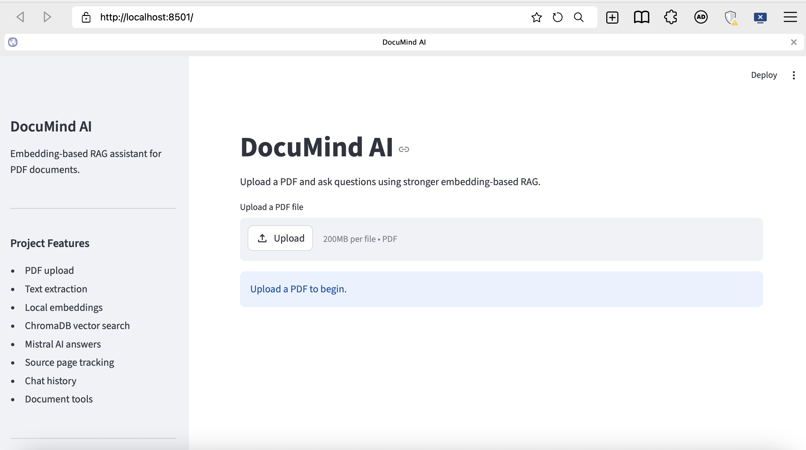
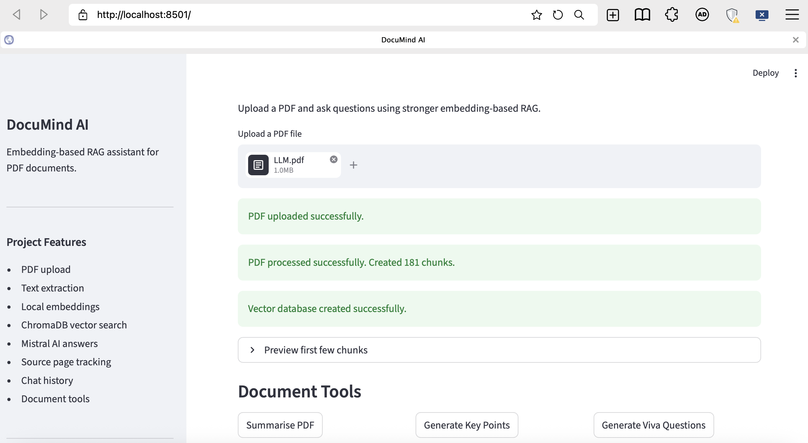
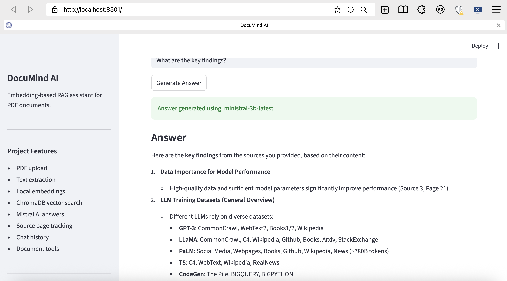
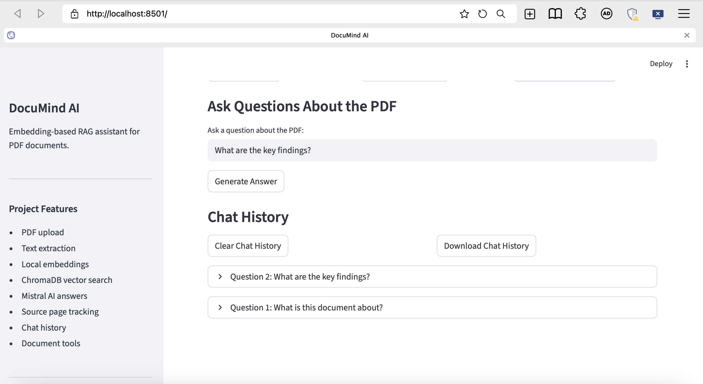

# DocuMind AI

DocuMind AI is an AI-powered document assistant that allows users to upload PDF files and ask questions about their content. The app uses an embedding-based RAG pipeline with ChromaDB, SentenceTransformers, and Mistral AI to retrieve relevant document chunks and generate clear answers with source page references.

This project was built using Python and Streamlit as a practical Generative AI and RAG portfolio project.

---

## Features

- Upload PDF documents
- Extract readable text from PDF files
- Split documents into smaller text chunks
- Generate local embeddings using SentenceTransformers
- Store and search document chunks using ChromaDB
- Retrieve the most relevant chunks based on the user question
- Generate answers using Mistral AI
- Show source page numbers for retrieved chunks
- Summarise uploaded PDFs
- Generate key points from the PDF
- Generate viva or interview questions from the PDF
- Save chat history during the session
- Clear chat history
- Download chat history as a text file
- Professional sidebar with RAG settings

---

## Project Screenshots

Add your screenshots here after running the app.

### Home Page



### PDF Upload and Processing



### Question Answering



### Chat History



---

## Tech Stack

| Technology | Purpose |
|---|---|
| Python | Main programming language |
| Streamlit | Web app interface |
| Mistral AI API | Answer generation |
| pypdf | PDF text extraction |
| SentenceTransformers | Local text embeddings |
| ChromaDB | Vector database for document chunks |
| python-dotenv | Secure API key loading |
| Torch / Torchvision | Dependency support for embedding models |

---

## How It Works

DocuMind AI follows a RAG pipeline:

```text
PDF Upload
→ Text Extraction
→ Text Chunking
→ Embedding Generation
→ ChromaDB Vector Storage
→ Semantic Retrieval
→ Mistral AI Answer Generation
→ Source Display

When a user uploads a PDF, the app extracts text from each page. The text is then split into smaller chunks. Each chunk is converted into an embedding using a local SentenceTransformer model. These embeddings are stored in ChromaDB.

When the user asks a question, the app converts the question into an embedding and searches ChromaDB for the most relevant chunks. These chunks are then sent to Mistral AI, which generates an answer based only on the retrieved document content.

Folder Structure

documind-ai/
│
├── app.py
├── main.py
├── requirements.txt
├── README.md
├── .env
├── .gitignore
│
├── screenshots/
│   ├── home.png
│   ├── pdf-upload.png
│   ├── question-answering.png
│   └── chat-history.png
│
└── venv/

Example Questions

After uploading a PDF, users can ask questions like:
What is this document about?
Summarise the main points of this PDF.
What methods are mentioned in the document?
Generate viva questions from this PDF.
What are the key findings?

Main App Tools
1. Ask Questions

Users can ask natural language questions about the uploaded PDF. The app retrieves relevant chunks and generates an answer using Mistral AI.

2. Summarise PDF

This button creates a simple summary of the uploaded document.

3. Generate Key Points

This button extracts the most important points from the document.

4. Generate Viva Questions

This button creates viva or interview questions with short model answers.

5. Chat History

The app stores previous questions and answers during the session.

6. Download Chat History

Users can download their conversation as a .txt file.

Why This Project Is Useful

Many people work with long PDF documents such as reports, research papers, lecture notes, policies, and manuals. Reading these documents manually can take a lot of time.

DocuMind AI helps users quickly understand documents by allowing them to ask questions, generate summaries, extract key points, and prepare viva or interview questions.

This project shows practical skills in:

Generative AI
Retrieval-Augmented Generation
Embedding-based search
Vector databases
PDF processing
Streamlit app development
API integration
Prompt engineering

Author

Nadeem Ur Rehman
AI and Data Science Graduate

GitHub: @sardarnadeem92